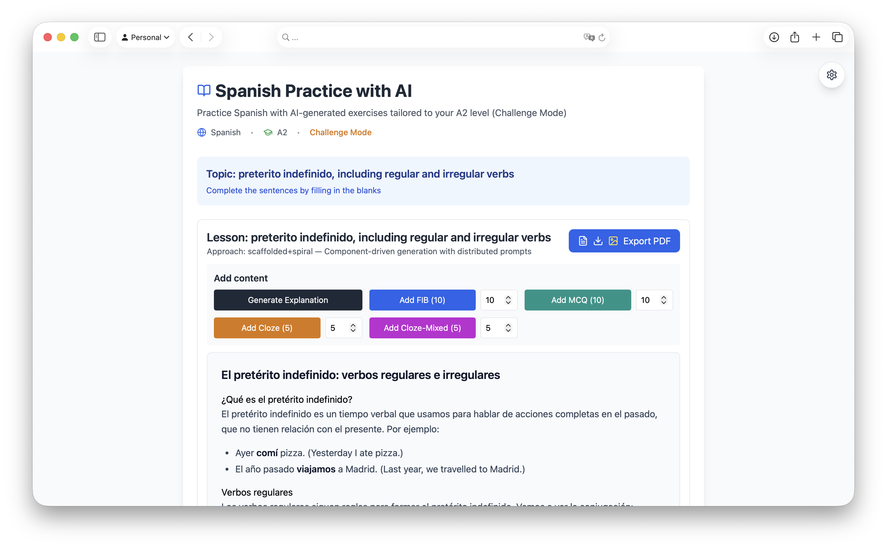

# Language AI App

AI-powered language practice app with multi-provider LLM backend (OpenRouter, Ollama, Runware, Fal.ai).



## Run locally

1. Create `.env` in project root:

```
PORT=3000
PROVIDER=openrouter # or ollama

# OpenRouter
OPENROUTER_API_KEY=your_key
OPENROUTER_MODEL=anthropic/claude-3.5-sonnet
APP_URL=http://localhost:5173

# Ollama local
OLLAMA_HOST=http://127.0.0.1:11434
OLLAMA_MODEL=qwen2.5:14b
```

2. Install and run:

```
npm i
npm run dev
```

- Frontend: http://localhost:5173
- Backend: http://localhost:3000

## Build and run production

```
npm run build
npm start
```

Serves built frontend from the backend on port 3000.

## Docker

Build and run with Docker:

```
docker build -t language-ai-app .
docker run --rm -p 3000:3000 \
  -e NODE_ENV=production \
  -e PROVIDER=openrouter \
  -e OPENROUTER_API_KEY=your_key \
  language-ai-app
```

Or with docker-compose (reads env from your shell):

```
docker compose up --build
```

For Ollama, ensure Ollama is running on your host (default `127.0.0.1:11434`). On macOS, `host.docker.internal` is used inside the container via compose.

### Persistent cache volume

- The app persists cache and analytics when run in Docker.
- A volume is mounted at `/data` inside the container (configurable with `CACHE_DIR`, default `/data`).
- Configure the host path via `CACHE_HOST_DIR` in your `.env`. The deploy script ensures the directory exists on the remote host.
- See `docs/persistent-caching-plan.md` for full design (schema versions in `shared/schemaVersions.js`, LRU, image persistence for Cloze, etc.).

## Switching providers

Set `PROVIDER` to one of:

- `openrouter`
- `ollama`

Optionally override the default model via corresponding `*_MODEL` env vars.


